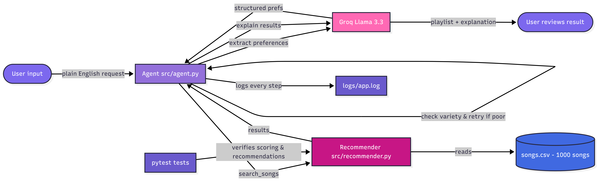
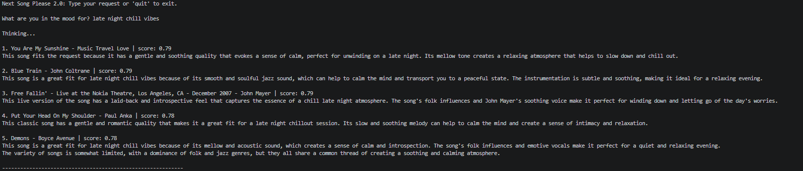
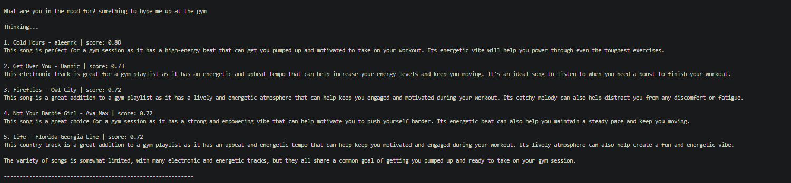
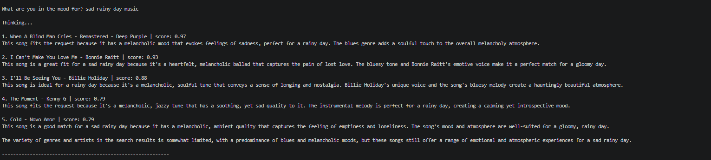

# Next Song Please 2.0: Music Recommender with Agentic Workflow

## Project Summary

This project is a music recommender that understands plain English requests and is built as an extension of a content-based filtering engine. The system uses an AI agent powered by Groq to interpret what the user is in the mood for, search the song catalog, self-evaluate variety, and return a curated playlist with an explanation.

It demonstrates how a conversational AI layer can replace rigid inputs and make technical systems accessible.

## Original Project

This is an extension of **Next Song Please 1.0**. The original system scored songs using a weighted formula on mood, genre, energy and acousticness, and returned the top 5 matches with explanations. It was built to explore how content-based filtering works.

## Architecture Overview



The user types a request. The agent uses Groq to extract preferences, then searches the song catalog using the scoring formula. Python checks the playlist variety and retries with a relaxed genre if needed. The final results are passed back to Groq, which then explains the playlist choices. Every step is logged, and the scoring logic is covered by automated tests.

## Demo

[Watch the walkthrough](https://www.loom.com/share/1726f05801024f4a93d33d9d60690da8)

## Setup Instructions

1. **Clone the repository**
   ```bash
   git clone https://github.com/yordanos-ayelework/applied-ai-system-project.git
   cd applied-ai-system-project
   ```

2. **Create a virtual environment (optional)**
   ```bash
   python -m venv .venv
   source .venv/bin/activate      # Mac/Linux
   .venv\Scripts\activate         # Windows
   ```

3. **Install dependencies**
   ```bash
   pip install -r requirements.txt
   ```

4. **Dataset**
   Song data sourced from the [Spotify Tracks Dataset](https://www.kaggle.com/datasets/maharshipandya/-spotify-tracks-dataset) on Kaggle. To regenerate `data/songs.csv` from the original download, place `dataset.csv` in the `data/` folder and run:
   ```bash
   python data/build_songs.py
   ```

5. **Set up your Groq API key**
   - Get a free key at [console.groq.com](https://console.groq.com)
   - Copy `.env.example` to `.env` and paste your key:
   ```
   GROQ_API_KEY=your_key
   ```

6. **Run the simulation (doesn't require API key)**
   ```bash
   python -m src.main --mode sim
   ```

7. **Run the AI agent (requires API key)**
   ```bash
   python -m src.main --mode agent
   ```

8. **Run tests**
   ```bash
   pytest
   ```

## Sample Interactions

**Example 1:** `late night chill vibes`


**Example 2:** `something to hype me up at the gym`


**Example 3:** `sad rainy day music`


## Design Decisions

**Agentic workflow**
A single prompt asking the AI to "recommend songs" would produce made-up results. By separating preference extraction, scoring, variety checking, and explanation into distinct steps, the AI's recommendations are grounded in real song data — the model handles language, the code handles logic.

**Groq (Llama 3.3)**
Groq offers a free tier with no billing required. It is accessible and reproducible for anyone cloning the repo. 

**Trade-offs:**
- The dataset has about 1,000 songs, which is large enough to demonstrate the system but small compared to real music services.
- The dataset has no attributes for artist style or demographics, so vague requests produce weak results. 
- Mood and genre use exact string matching, so synonyms are treated as different. 
- Variety checking runs in Python rather than the LLM tool calls. It's more reliable for recommendations but reduces the model's autonomy.

## Testing Summary

5/5 automated tests passed. Verified that the recommender sorts songs correctly, returns the right number of results, scores between 0 and 1, and always ranks a perfect match above a no-match.

The agent includes retry logic for failed AI calls and logs steps to logs/app.log. Manual testing confirmed the system consistently retrieves real songs before generating a response.

**Main limitation observed:** vague or demographic requests (e.g. "girly pop") produce weak results because the dataset has no attributes for artist style. Requests grounded in mood and energy (e.g. "sad rainy day", "gym hype") perform significantly better.


## Reflection

Building this project, I saw how AI tools marketed as "free" often aren't. Every provider I tried either required a credit card, had quota limits that blocked basic usage, or deprecated their models. I hadn't realized AI development would be this inaccessible.

I also learned that reliability is hard to get and keep. Getting the agent to work once wasn't too bad, but getting it to work consistently across different types of inputs required retry logic, guardrails, and switching models multiple times.